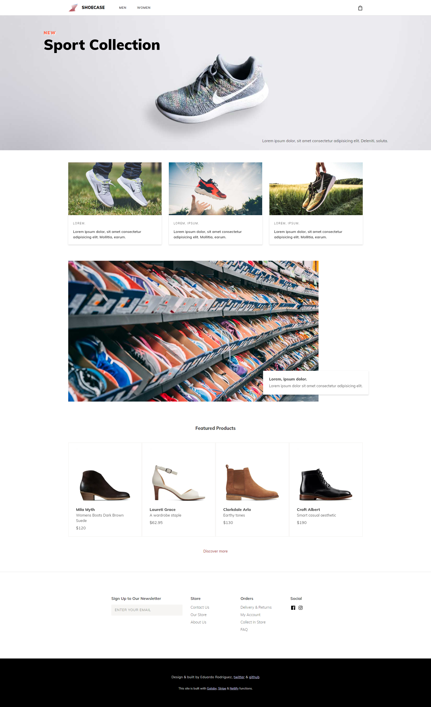

[](https://app.netlify.com/sites/ecommerce-shoe-store/deploys)

# 👟 Ecommerce Shoe Store

Demo site is here: [Shoe store demo](https://ecommerce-shoe-store.netlify.com/)



## Build Setup

```bash
# Install the Gatsby CLI
$ npm install -g gatsby-cli

# Install dependencies
$ npm install

# Start the development server
$ npm start
```

## Building and Running for Production

```bash
# Generate a full static production build
$ npm run build

# Preview the site as it will appear once deployed
$ npm run serve
```

## Built With

- [Gatsbyjs](https://www.gatsbyjs.org/) - React Toolchain
- [Hooks API](https://reactjs.org/docs/hooks-intro.html) - App State Management
- [Stripe](https://stripe.com/) - Handle Checkout Submit
- [Netlify](https://www.contentful.com/) - Handle Server Functions & Hosting

## License

This project is licensed under the MIT License - see the [LICENSE](LICENSE) file for details
